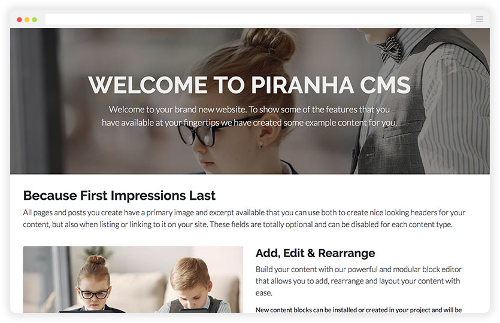

# Project Templates

> Piranha uses the `.NET CLI` tool `dotnet new` for creating new projects which is a cross platform and IDE independent approach to project creation. You can read more about `dotnet new` and the different standard options available [here](https://docs.microsoft.com/en-us/dotnet/core/tools/dotnet-new?WT.mc_id=DOP-MVP-5003834).

If you want to get started quickly the easiest way to get going is to use one of the **Templates** available. The templates are used to create a **new project** from scratch and not to add CMS functionality to an existing application.

If you want to add Piranha into an application, it's still a good start to create a new project from one of the templates and examine what happens in the `Startup.cs`.

## Installing the Templates

Project Templates for .NET are installed from the **CLI** using the `dotnet new` command. If you're updating an already installed template, make sure you specify the version you want to install.

~~~ bash
> dotnet new -i Piranha.Templates
~~~

### How To Use The Templates

When creating a new project with `dotnet new` you should first create a new empty folder. The default behaviour is that the new project is **named after its containing folder**. If you want to name your project differently that the current folder you can use the option `-n ProjectName`.

> Please note that naming your project `Piranha` (even if it is a test project) will result in a **circular reference error** when you try to restore the packages. This is due to a limitation in `dotnet restore`.

## Empty Template

Creates an empty project with Piranha that can be used as a boilerplate for general projects and API's for headless web applications.

~~~ bash
> dotnet new piranha.empty
~~~

### Options

The following options are available when generating an empty project.

~~~ bash
-d|--database   Specifies the database provider that should be used
                    SQLite        - Use SQLite as database
                    SQLServer     - Use SQL Server as database
                    MySql         - Use MySql as database
                    PostgreSql    - Use PostgreSql as database
                Default: SQLite

-s|--storage    Specifies the storage provider that should be used
                    FileStorage    - Use FileStorage for uploaded assets
                    BlobStorage    - Use Azure BlobStorage for uploaded assets
                Default: FileStorage
~~~

_NOTE: if you alter the defaults for either database or storage then you will need to set the corresponding connection strings in appsettings.json_

### Generated files

After executing `dotnet new` you should get a project containing the following files.

~~~ bash
wwwroot/
appsettings.json
editorconfig.json
Program.cs
Startup.cs
~~~

## Web Template For MVC

Creates an application for `ASP.NET MVC` with some default `Content Types` and `Views`. When starting the application for the first time you will be given the option to seed some test data to show you how to work with content in Piranha CMS.

~~~ bash
> dotnet new piranha.mvc
~~~

### Options

The following options are available when generating a MVC project.

~~~ bash
-d|--database   Specifies the database provider that should be used
                    SQLite        - Use SQLite as database
                    SQLServer     - Use SQL Server as database
                    MySql         - Use MySql as database
                    PostgreSql    - Use PostgreSql as database
                Default: SQLite

-s|--storage    Specifies the storage provider that should be used
                    FileStorage    - Use FileStorage for uploaded assets
                    BlobStorage    - Use Azure BlobStorage for uploaded assets
                Default: FileStorage
~~~

_NOTE: if you alter the defaults for either database or storage then you will need to set the corresponding connection strings in appsettings.json_

### Generated files

After executing `dotnet new` you should get a project containing the following files.

~~~ bash
assets/
  scss/
    inc/
        ...
    style.scss
Controllers/
    CmsController.cs
    SetupController.cs
Models/
    SaveCommentModel.cs
    StandardArchive.cs
    StandardPage.cs
    StandardPost.cs
seed/
    ...
Views/
    Cms/
        DisplayTemplates/
            ...
        ...
    Setup/
        ...
    Shared/
        ...
wwwroot/
    ...
appsettings.Development.json
appsettings.json
compilerconfig.json
compilerconfig.json.defaults
editorconfig.json
gulpfile.js
package.json
Program.json
Startup.json
~~~

After the project is setup you can safely remove `SetupController.cs` and the folder `seed` as these are only used for creating example content during the setup process.

If you want to continue by modifying the included `scss` styles in the project, and you're not running `Visual Studio` you need to install the dependencies for handling the frontend pipeline with:

~~~ bash
> npm install
~~~

## Web Template For Razor Pages

Creates an application for `Razor Pages` with some default `Content Types` and `Pages`. When starting the application for the first time you will be given the option to seed some test data to show you how to work with content in Piranha CMS.

~~~ bash
> dotnet new piranha.razor
~~~

### Options

The following options are available when generating a Razor project.

~~~ bash
-d|--database   Specifies the database provider that should be used
                    SQLite        - Use SQLite as database
                    SQLServer     - Use SQL Server as database
                    MySql         - Use MySql as database
                    PostgreSql    - Use PostgreSql as database
                Default: SQLite

-s|--storage    Specifies the storage provider that should be used
                    FileStorage    - Use FileStorage for uploaded assets
                    BlobStorage    - Use Azure BlobStorage for uploaded assets
                Default: FileStorage
~~~

_NOTE: if you alter the defaults for either database or storage then you will need to set the corresponding connection strings in appsettings.json_

### Generated files

After executing `dotnet new` you should get a project containing the following files.

~~~ bash
assets/
  scss/
    inc/
        ...
    style.scss
Controllers/
    CmsController.cs
Models/
    SaveCommentModel.cs
    StandardArchive.cs
    StandardPage.cs
    StandardPost.cs
Pages/
    DisplayTemplates/
        ...
    _Layout.cshtml
    _ViewImports.cshtml
    _ViewStart.cshtml
    Archive.cshtml
    Page.cshtml
    Post.cshtml
seed/
    ...
Views/
    Setup/
        ...
wwwroot/
    ...
appsettings.Development.json
appsettings.json
compilerconfig.json
compilerconfig.json.defaults
editorconfig.json
gulpfile.js
package.json
Program.json
Startup.json
~~~

After the project is setup you can safely remove `SetupController.cs` and the folder `seed` as these are only used for creating example content during the setup process.

If you want to continue by modifying the included `scss` styles in the project, and you're not running `Visual Studio` you need to install the dependencies for handling the frontend pipeline with:

~~~ bash
> npm install
~~~
