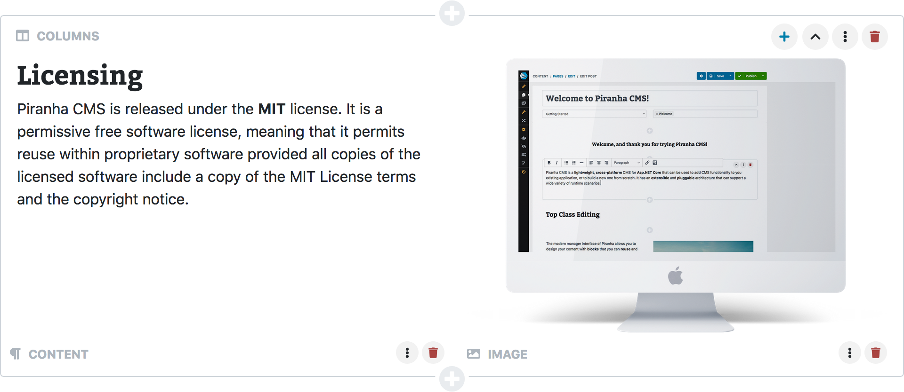
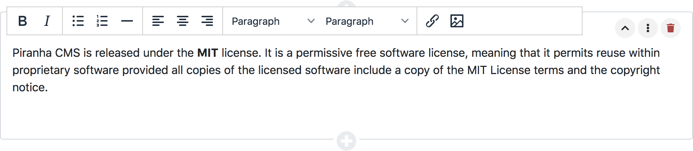
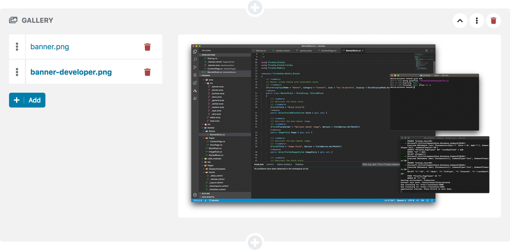

# Standard Blocks

> Please note that even though we try to give the editors the best experience possible when editing their content, there's **no correlation** between how blocks are rendered in the manager and in your application.
>
> If you want the block styled in the same way as in your web application, you need to add **custom styles** to the manager.
>
> [Read About Custom Resources](../manager-extensions/custom-resources)

## Audio

`Piranha.Extend.Blocks.AudioBlock`

## Columns

`Piranha.Extend.Blocks.ColumnBlock`

The Column block is a built in `Block Group` that can contain one or more other blocks.

    using System.Collections.Generic;
    using Piranha.Extend;
    using Piranha.Extend.Blocks;

    var page = MyPage.Create(api);

    page.Blocks.Add(new ColumnBlock
    {
        Items = new List<Block> {
            new HtmlBlock
            {
                Body = "
This is some HTML
"
            },
            new HtmlBlock
            {
                Body = "
This is some more HTML
"
            }
        }
    });

## Content

`Piranha.Extend.Blocks.HtmlBlock`

The block has a single `HtmlField` that you can access from your code in the same way as any Html field.

    using Piranha.Extend.Blocks;

    var page = MyPage.Create(api);

    page.Blocks.Add(new HtmlBlock
    {
        Body = "
This is some HTML
"
    });

The block is displayed as a **one column** HTML-editor in the manager. You can read more about the default HTML-editor Piranha uses [here](../components/html-editor).

## Gallery

`Piranha.Extend.Blocks.ImageGalleryBlock`

## Image

`Piranha.Extend.Blocks.ImageBlock`

## Quote

`Piranha.Extend.Blocks.QuoteBlock`

## Separator

`Piranha.Extend.Blocks.SeparatorBlock`

## Text

`Piranha.Extend.Blocks.TextBlock`

## Video

`Piranha.Extend.Blocks.VideoBlock`