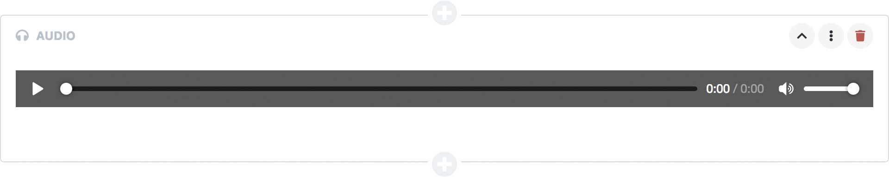
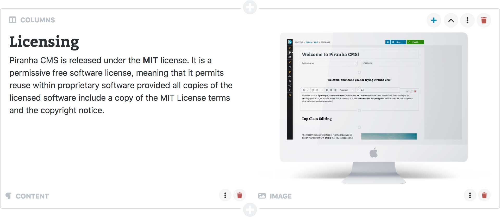
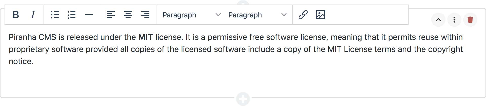
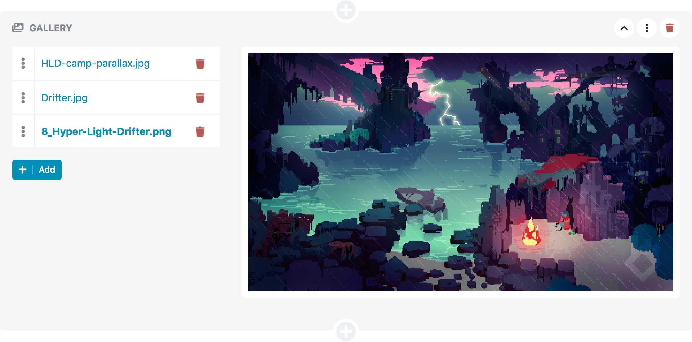
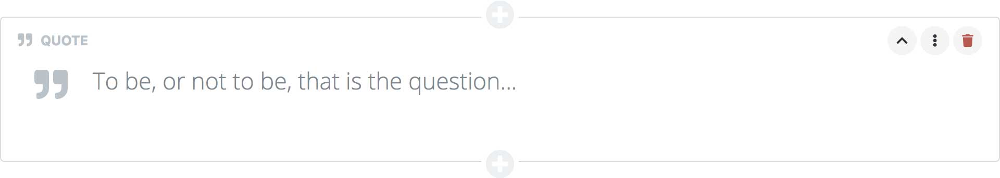
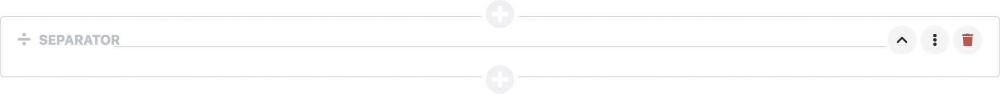

# Blocks

> Blocks should be used for pieces of content that can occur **any number of times**, at **any position** in the main content area. For fixed elements with a fixed number of occurrences Regions are a better match.

Blocks are the main building piece for **pages** and **posts**, it's the part of the content that the editor has total control over. Blocks are small chunks of content that can be added, deleted and reordered. As the content administrators choose for themselves which blocks they add you don't specify anywhere on the Content Type which blocks to use.

For information on how to build your own blocks, please refer to [Blocks](../extensions/blocks) in the section **Extensions**.

## Included Blocks

> #### A Note About Rendering
> Please note that even though we try to give the editors the best experience possible when editing their content, there's **no correlation** between how blocks are rendered in the manager and in your application. If you want the blocks to be styled in the same way as in your application, you need to add [custom styles](../manager-extensions/resources) to the manager.

### Audio

`Piranha.Extend.Blocks.AudioBlock`

The block has a single `AudioField` that you can access from your code in the same way as any Audio field.

~~~ csharp
using Piranha.Extend.Blocks;
using Piranha.Models;

var page = MyPage.Create(api);
var audio = api.Media.GetAll().First(m => m.Type == MediaType.Audio);

page.Blocks.Add(new AudioBlock
{
    Body = audio
});
~~~

The block displays an audio player. When hovering the block the filename together with buttons for opening the media dialog and removing the currently selected audio file is shown.

### Columns

`Piranha.Extend.Blocks.ColumnBlock`

The Column block is a built in `Block Group` that can contain one or more other blocks.

~~~ csharp
using System.Collections.Generic;
using Piranha.Extend;
using Piranha.Extend.Blocks;

var page = MyPage.Create(api);

page.Blocks.Add(new ColumnBlock
{
    Items = new List<Block> {
        new HtmlBlock
        {
            Body = "
This is some HTML
"
        },
        new HtmlBlock
        {
            Body = "
This is some more HTML
"
        }
    }
});
~~~

### Content

`Piranha.Extend.Blocks.HtmlBlock`

The block has a single `HtmlField` that you can access from your code in the same way as any Html field.

~~~ csharp
using Piranha.Extend.Blocks;

var page = MyPage.Create(api);

page.Blocks.Add(new HtmlBlock
{
    Body = "
This is some HTML
"
});
~~~

The block is displayed as a **one column** HTML-editor in the manager. You can read more about the default HTML-editor Piranha uses [here](../components/html-editor).

### Gallery

`Piranha.Extend.Blocks.ImageGalleryBlock`

The Gallery block is a built in `Block Group` that can contain one or more image blocks. It uses the `MasterDetail` display mode where the items are shown in a list to the left and the currently selected item is shown to the right.

### Image

`Piranha.Extend.Blocks.ImageBlock`

The block has a single `ImageField` that you can access from your code in the same way as any Image field.

~~~ csharp
using Piranha.Extend.Blocks;
using Piranha.Models;

var page = MyPage.Create(api);
var image = api.Media.GetAll().First(m => m.Type == MediaType.Image);

page.Blocks.Add(new ImageBlock
{
    Body = image
});
~~~

The block displays an image preview. When hovering the block the filename together with buttons for setting prefered aspect, opening the media dialog and removing the currently selected image is shown.

#### Prefered Aspect

For image blocks you can choose the preferect aspect you'd like to show the image in the current context. This will crop the image accordingly and is very useful for using the image in different ways. The supported aspects are:

* `Original` - The uncropped original image
* `Landscape` - The image cropped to 3x2 ratio
* `Portrait` - The image cropped to 2x3 ratio
* `Widescreen` - The image cropped to 16x9 ratio
* `Square` - The image cropped to 1x1 ratio

Please note that for this setting to take effect, the web template needs respect the prefered aspect by resizing the image block in it's display template. This can for example be done with:

~~~ csharp
@model Piranha.Extend.Blocks.ImageBlock

~~~

In whis case, `1110` is the maximum width the image can be in the web template.

### Quote

`Piranha.Extend.Blocks.QuoteBlock`

The block has a single `TextField` that you can access from your code in the same way as any text field.

~~~ csharp
using Piranha.Extend.Blocks;

var page = MyPage.Create(api);

page.Blocks.Add(new QuoteBlock
{
    Body = "To be, or not to be, that is the question..."
});
~~~

The block is displayed as an inline textarea in the manager with a somewhat larget font size.

### Separator

`Piranha.Extend.Blocks.SeparatorBlock`

The block is used to separate content blocks and does not have any content of its own. In a web application it is often rendered as a `
` tag.

### Text

`Piranha.Extend.Blocks.TextBlock`

The block has a single `TextField` that you can access from your code in the same way as any text field.

~~~ csharp
using Piranha.Extend.Blocks;

var page = MyPage.Create(api);

page.Blocks.Add(new TextBlock
{
    Body = "This is some unformatted text"
});
~~~

The block is displayed as an inline textarea in the manager with a monospace typeface.

### Video

`Piranha.Extend.Blocks.VideoBlock`

The block has a single `VideoField` that you can access from your code in the same way as any Video field.

~~~ csharp
using Piranha.Extend.Blocks;
using Piranha.Models;

var page = MyPage.Create(api);
var video = api.Media.GetAll().First(m => m.Type == MediaType.Video);

page.Blocks.Add(new VideoBlock
{
    Body = video
});
~~~

The block displays a video preview. When hovering the block the filename together with buttons for opening the media dialog and removing the currently selected video is shown. Note that the block **only** works for videos uploaded into Piranha as media assets and does not accept videos from other streaming services.

