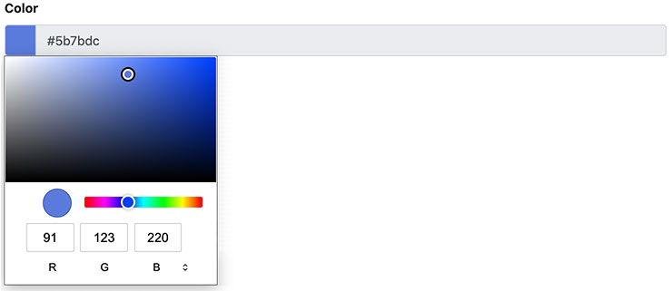

# Fields

> Fields are the lowest level of content in Piranha CMS and are used to build up **Regions** and **Blocks**. You can think of Fields as the different data types that you can use to build structures with. When defining a field in your Region or Block you can set the following properties with the `FieldAttribute`.

## Field Configuration

##### Title

~~~ csharp
public class MyRegionarbitrary
{
    [Field(Title = "The Title")]
    public StringField Title { get; set; }

    [Field]
    public TextField Body { get; set; }
}
~~~

Optional title to be shown in the manager interface. If this property is left empty the **property name** is used.

##### Options

~~~ csharp
public class MyRegion
{
    [Field(Options = FieldOption.HalfWidth)]
    public StringField Title { get; set; }

    [Field(Options = FieldOption.HalfWidth)]
    public StringField SubTitle { get; set; }

    [Field]
    public TextField Body { get; set; }
}
~~~

A set of flags defining additional field behavior. At the moment the only flag available is `HalfWidth` which tells the manager interface that the field should only take up 50% of the available space so that another field can be display next to it.

##### Placeholder

~~~ csharp
[Field(Placeholder = "Please enter your full name")]
public StringField Name { get; set; }
~~~

Optional placeholder text. The placeholder text is shown for `CheckBoxField`, `DateField`, `NumberField` and `StringField`. For the CheckBox Field the placeholder text is shown as the checkbox **label**.

##### Field Description

~~~ csharp
[Field]
[FieldDescription("Full street address including zip code")]
public StringField Address { get; set; }
~~~

Optional description that is shown above the field in the manager. This can be used to provide guidance and help to content editors when editing content.

## Included Fields

### Audio

`Piranha.Extend.Fields.AudioField`

The Audio Field has a `Guid` reference to the assigned media asset id and **implicit operators** for converting it from and to a Guid and a Media asset.

~~~ csharp
using Piranha.AttributeBuilder;
using Piranha.Models;
using Piranha.Extend.Fields;

public MyPage : Page<MyPage>
{
    public class ComplexRegion
    {
        [Field]
        public AudioField MyAudio { get; set; }

        ...
    }

    [Region]
    public ComplexRegion MyRegion { get; set; }
}
~~~

The Audio Field works **exactly** like the Document Field except that the media library is filtered to only show the available audio assets to the editor.

### Checkbox

`Piranha.Extend.Fields.CheckBoxField`

The CheckBox Field has a single `bool` value and **implicit operators** for converting it from and to a bool. This means you can easily manipulate your field values like so:

~~~ csharp
using Piranha.AttributeBuilder;
using Piranha.Models;
using Piranha.Extend.Fields;

[PageType]
public MyPage : Page<MyPage>
{
    public class ComplexRegion
    {
        [Field(Placeholder = "Check me out!")]
        public CheckBoxField MyBoolValue { get; set; }

        ...
    }

    [Region]
    public ComplexRegion MyRegion { get; set; }
}

var page = await MyPage.CreateAsync(api);
page.MyRegion.MyBoolValue = true;
~~~

The field is displayed as a checkbox in the manager for content editors. Any text that add into the `Placeholder` property of the `FieldAttribute` will be displayed to the right of the CheckBox. The field is **primarily** intended to be used in **complex regions** and not as a Single Field Region.

### Color

`Piranha.Extend.Fields.ColorField`

The Color Field has a single `string` value and implicit operators for converting it from and to a string. This means you can easily manipulate your field values:

~~~ csharp
using Piranha.AttributeBuilder;
using Piranha.Models;
using Piranha.Extend.Fields;

[PageType]
public MyPage : Page<MyPage>
{
    [Field(Placeholder = "Check me out!")]
    public ColorField MyColorValue { get; set; }
}

var page = MyPage.Create(api);
page.MyColorValue = "#000";
~~~

The field is displayed as a color picker in the manager interface.

#### Settings

The color field has the following settings that can be configured with the `ColorFieldSettingsAttribute`.

##### DefaultValue

~~~ csharp
using Piranha.Extend.Fields.Settings;

[Field(Placeholder = "Check me out!")]
[ColorFieldSettings(DefaultValue = "#fff")]
public ColorField MyColorValue { get; set; }
~~~

Sets the default value of the field for newly created models.

##### DisallowInput

~~~ csharp
using Piranha.Extend.Fields.Settings;

[Field(Placeholder = "Check me out!")]
[ColorFieldSettings(DisallowInput = true)]
public ColorField MyColorValue { get; set; }
~~~

When this setting is set to `true` content editors won't be able to write a value into the color field, they must use the color picker to select a value. The default value is `false`.

### Data select

`Piranha.Extend.Fields.DataSelectField<T>`

The Data select Field is used to create a drop down list from an external data source. The item type of the select is provided as type argument.

To implement a data select you need to implement **your own** item with the methods `GetById()` and `GetList()`. Both these methods must be **static** and support direct injection of arguments. Please note that the **first** argument to `GetById` will always be the `Id` of the item as a string.

As an example let's take a look on how you could implement a select list with all of the pages in the database.

#### The item class
~~~ csharp
using System;
using System.Collections.Generic;
using System.Linq;
using System.Threading.Tasks;
using Piranha;
using Piranha.Extend.Fields;
using Piranha.Models;

public class PageItem
{
    // The id of the page
    public Guid Id { get; set; }

    // The model
    public PageInfo Model { get; set; }

    // Gets a single item with the provided id using the
    // injected services you specify.
    static async Task<PageItem> GetById(string id, IApi api)
    {
        return new PageItem
        {
            Id = new Guid(id),
            Model = await api.Pages.GetByIdAsync<PageInfo>(new Guid(id))
        };
    }

    // Gets all of the available items to choose from using
    // the injected services you specify.
    static async Task<IEnumerable<DataSelectFieldItem>> GetList(IApi api)
    {
        var pages = await api.Pages.GetAllAsync();

        return pages.Select(p => new DataSelectFieldItem
        {
            Id = p.Id.ToString(),
            Name = p.Title
        });
    }
}
~~~

#### The Content type
~~~ csharp
using Piranha.AttributeBuilder;
using Piranha.Models;
using Piranha.Extend.Fields;

public MyPage : Page<MyPage>
{
    public class ComplexRegion
    {
        [Field]
        public DataSelectField<PageItem> DataSelect { get; set; }

        ...
    }

    [Region]
    public ComplexRegion MyRegion { get; set; }
}
~~~

The field is displayed as a **select field** in the manager with the text entered in the `Title` of the items returned from `GetList()` as the item text.

### Date

`Piranha.Extend.Fields.DateField`

The Date Field has a single `DateTime` value and **implicit operators** for converting it from and to a DateTime. As no special processing is done on the entered DateTime, this means it is fully possible to actually set a date **and** time when assigning the field.

~~~ csharp
using Piranha.AttributeBuilder;
using Piranha.Models;
using Piranha.Extend.Fields;

[PageType]
public MyPage : Page<MyPage>
{
    public class ComplexRegion
    {
        [Field(Placeholder = "Give me a date!")]
        public DateField MyDateValue { get; set; }

        ...
    }

    [Region]
    public ComplexRegion MyRegion { get; set; }
}

var page = await MyPage.CreateAsync(api);
page.MyRegion.MyDateValue = DateTime.Now;
~~~

The field is displayed as a single line textfield with a visual **datepicker** component in the manager. This means content editors can't set a time to the field value. The field is **primarily** intended to be used in **complex regions** and not as a Single Field Region.

### Document

`Piranha.Extend.Fields.DocumentField`

The Document Field has a `Guid` reference to the assigned media asset id and **implicit operators** for converting it from and to a Guid and a Media asset.

~~~ csharp
using Piranha.AttributeBuilder;
using Piranha;
using Piranha.Models;
using Piranha.Extend.Fields;

[PageType]
public MyPage : Page<MyPage>
{
    public class ComplexRegion
    {
        [Field]
        public DocumentField MyDocumentValue { get; set; }

        ...
    }

    [Region]
    public ComplexRegion MyRegion { get; set; }
}

// Get the first document from the library
var document = await api.Media.GetAllAsync().First(m => m.Type == MediaType.Document);

var page = await MyPage.CreateAsync(api);

// Set the reference by media asset
page.MyRegion.MyDocumentValue = document;

// Set the reference by id
page.MyRegion.MyDocumentValue = document.Id;
~~~

When the page model is loaded from the `MediaRepository` the referenced document is included. This means that after loading the page you have access to all the information of the media file.

~~~ csharp
using Piranha;

var page = await api.Pages.GetByIdAsync<MyPage>(...);

if (page.MyRegion.MyDocumentValue.HasValue)
{
    return page.MyRegion.MyDocumentValue.Media.ContentType;
}
~~~

The field can also be implicitly converted to a **string**, in which case it returns the `PublicUrl` if there's a media asset available. This is quite handy when using the field in views.

~~~ csharp
@model MyPage

@if (Model.MyRegion.MyDocumentValue.HasValue)
{
    <h1>Link to document</h1>
    <a href="@Url.Content(Model.MyRegion.MyDocumentValue)">
        @Model.MyRegion.MyDocumentValue.Media.Filename
    </a>
}
~~~

The field is displayed in the manager with the filename of the currently selected document and buttons for choosing a file from the media library. When opening the media library it is automatically filtered so that only **folders** and **documents** are available to the editor. The field is **primarily** intended to be used in **complex regions** and not as a Single Field Region.

### Html

`Piranha.Extend.Fields.HtmlField`

The Html Field has a single `string` value and **implicit operators** for converting it from and to a string.

~~~ csharp
using Piranha.AttributeBuilder;
using Piranha.Models;
using Piranha.Extend.Fields;

[PageType]
public class MyPage : Page<MyPage>
{
    [Region]
    public HtmlField MyHtmlValue { get; set; }
}

var page = await MyPage.CreateAsync(api);
page.MyHtmlValue = "
Hello world!
";
~~~

Remember that when using the value in a `view` you need to render it as **raw** HTML, or the markup will be escaped.

~~~ csharp
@model MyPage

<h1>@Model.Title<h1>

@Html.Raw(Model.MyHtmlValue)
~~~

The field is displayed as a HTML Editor in the manager. The default editor shipped with the manager is provided by [TinyMCE](https://www.tiny.cloud). The field works equally well in **complex regions** as a **single field region**. For more information about the default configuration of the HTML Editor and how to customize it, please refer to [HTML Editor](../extensions/html-editor).

### Image

`Piranha.Extend.Fields.ImageField`

The Image Field has a `Guid` reference to the assigned media asset id and **implicit operators** for converting it from and to a Guid and a Media asset.

~~~ csharp
using Piranha.AttributeBuilder;
using Piranha.Models;
using Piranha.Extend.Fields;

public MyPage : Page<MyPage>
{
    public class ComplexRegion
    {
        [Field]
        public ImageField MyImageValue { get; set; }

        ...
    }

    [Region]
    public ComplexRegion MyRegion { get; set; }
}
~~~

Like the Document Field its implicit operators enable you to use it directly in the `img` tags.

~~~ csharp
@model MyPage

<h1>@Model.Title</h1>

@if (Model.MyRegion.MyImageValue.HasValue)
{
    
}
~~~

The Image Field works **exactly** like the Document Field except that the media library is filtered so that only **folders** and **images** are available to the editor.

### Markdown

`Piranha.Extend.Fields.MarkdownField`

The Markdown Field has a `single` string value and **implicit operators** for converting the markdown content from and to a string. It also has a help method for converting the value to to **HTML**. When **implicitly** converting the Markdown Field **to** a string it also converts it to HTML.

~~~ csharp
using Piranha;
using Piranha.AttributeBuilder;
using Piranha.Models;
using Piranha.Extend.Fields;

[PageType]
public MyPage : Page<MyPage>
{
    [Region]
    public MarkdownField MyMarkdownValue { get; set; }
}

var page = await MyPage.CreateAsync(api);
page.MyMarkdownValue = "#This is a header\n\nThis is a paragraph."

var html = page.MyMarkdownValue.ToHtml();
~~~

Remember that when using the HTML value in a `view` you need to render it as **raw** HTML, or the markup will be escaped.

~~~ csharp
@model MyPage

<h1>@Model.Title</h1>

@Html.Raw(Model.MyMarkdownValue)
~~~

The field is displayed as a Markdown Editor with HTML preview in the manager. If the field is used in a complex region the preview and edit views are shown in **tabs**, in single field regions they are displayed **side-by-side**.

### Media

`Piranha.Extend.Fields.MediaField`

The Media Field has a `Guid` reference to the assigned media asset id and **implicit operators** for converting it from and to a Guid and a Media asset.

~~~ csharp
using Piranha.AttributeBuilder;
using Piranha.Models;
using Piranha.Extend.Fields;

public MyPage : Page<MyPage>
{
    public class ComplexRegion
    {
        [Field]
        public MediaField MyMediaValue { get; set; }

        ...
    }

    [Region]
    public ComplexRegion MyRegion { get; set; }
}
~~~

The Media Field works **exactly** like the Document Field except that the media library is unfiltered and shows all available assets to the editor.

### Number

`Piranha.Extend.Fields.NumberField`

The Number Field has a single `int` value and **implicit operators** for converting it from and to an int.

~~~ csharp
using Piranha;
using Piranha.Models;
using Piranha.Extend.Fields;

public MyPage : Page<MyPage>
{
    public class ComplexRegion
    {
        [Field]
        public NumberField MyNumberValue { get; set; }

        ...
    }

    [Region]
    public ComplexRegion MyRegion { get; set; }
}

var page = await MyPage.CreateAsync(api);
page.MyRegion.MyNumberValue = 23;
~~~

Please note that the `int` value is **nullable** and optional to the content editor, so make sure that you check the field before using it.

~~~ csharp
@model MyPage

@if (Model.MyRegion.MyNumberValue.Value.HasValue)
{
    <h1>The number is @Model.MyRegion.MyNumberValue.Value</h1>
}
~~~

The field is displayed as a single line textfield in the manager. The field is **primarily** intended to be used in **complex regions** and not as a Single Field Region.

### Page

`Piranha.Extend.Fields.PageField`

The Page Field has a `Guid` reference to the assigned page id and **implicit operators** for converting it from and to a Guid and a Page model.

~~~ csharp
using Piranha;
using Piranha.Models;
using Piranha.Extend.Fields;

public MyPage : Page<MyPage>
{
    public class ComplexRegion
    {
        [Field]
        public PageField MyPageValue { get; set; }

        ...
    }

    [Region]
    public ComplexRegion MyRegion { get; set; }
}

var startpage = await api.Pages.GetStartpageAsync();

var page = await MyPage.CreateAsync(api);
page.MyRegion.MyPageValue = startpage;
~~~

When the Page Model containing the field is loaded from the `PageRepository` the **referenced page** is **included** so that it can be accessed when working with the page. It also has some handy methods for checking if the field has an assigned page and accessing it in different ways.

Please note that getting the page as a full model will result in another call to the Api.

~~~ csharp
var page = await api.Pages.GetByIdAsync<MyPage>(...);

if (page.MyRegion.MyPageValue.HasValue)
{
    // Get the assigned page as an info model
    var infoModel = page.MyRegion.MyPageValue.Page;

    // Get the assigned page as a full model
    var typedModel = page.MyRegion.MyPageValue.GetPage<MyOtherPageType>(api);
}
~~~

The field is displayed in the manager with the page title of the currently selected page and buttons for choosing a page from **any of the available sitemaps**. The field is **primarily** intended to be used in **complex regions** and not as a Single Field Region.

### Post

`Piranha.Extend.Fields.PostField`

The Post Field has a `Guid` reference to the assigned post id and **implicit operators** for converting it from and to a Guid and a Post model.

~~~ csharp
using Piranha;
using Piranha.Models;
using Piranha.Extend.Fields;

public MyPage : Page<MyPage>
{
    public PostField MyPost { get; set; }
}

var post = await api.Posts.GetByIdAsync(..);

var page = await MyPage.CreateAsync(api);
page.MyPost = post;
~~~

The Post Field works exactly like the Page Field except that it shows the available posts from **all** post archives.

### Select

`Piranha.Extend.Fields.SelectField<T>`

The Select Field is used to create a dropdown list from an `enum`. The enum type is provided as type argument to the generic type.

~~~ csharp
using System.ComponentModel.DataAnnotations;
using Piranha;
using Piranha.Models;
using Piranha.Extend.Fields;

public MyPage : Page<MyPage>
{
    public enum PageStyle
    {
        [Display(Description = "Standard width")]
        Standard,
        [Display(Description = "Narrow width")]
        Narrow,
        [Display(Description = "Extra wide")]
        Wide
    }

    [Region]
    public SelectField<PageStyle> Style { get; set; }
}

var page = await MyPage.CreateAsync(api);
page.Style.Value = PageStyle.Wide;
~~~

The field is displayed as a **select field** in the manager with the text entered in the `DisplayAttribute` as the item text. If no attribute is defined the **enum name** is used to display the item in the select list.

### String

`Piranha.Extend.Fields.StringField`

The String Field has a single `string` value and **implicit operators** for converting the content from and to a string.

~~~ csharp
using Piranha;
using Piranha.Models;
using Piranha.Extend.Fields;

public MyPage : Page<MyPage>
{
    public class ComplexRegion
    {
        [Field(Placeholder = "Just enter a string!")]
        public StringField MyStringValue { get; set; }

        ...
    }

    [Region]
    public ComplexRegion MyRegion { get; set; }
}

var page = await MyPage.CreateAsync(api);
page.MyRegion.MyStringValue = "Just a string";
~~~

The field is displayed as a single line textfield in the manager. The field is **primarily** intended to be used in **complex regions** and not as a Single Field Region.

#### Settings

The string field has the following settings that can be configured with the `StringFieldSettingsAttribute`.

##### DefaultValue

~~~ csharp
using Piranha.Extend.Fields.Settings;

[Field(Placeholder = "Check me out!")]
[StringFieldSettings(DefaultValue = "Hello world")]
public StringField MyStringValue { get; set; }
~~~

Sets the default value of the field for newly created models.

##### MaxLength

~~~ csharp
using Piranha.Extend.Fields.Settings;

[Field(Placeholder = "Check me out!")]
[StringFieldSettings(MaxLength = 32)]
public StringField MyStringValue { get; set; }
~~~

Sets the maximum length the string field should accept.

### Text

`Piranha.Extend.Fields.TextField`

The Text Field has a single `string` value and **implicit operators** for converting the content from and to a string.

~~~ csharp
using Piranha;
using Piranha.Models;
using Piranha.Extend.Fields;

public MyPage : Page<MyPage>
{
    public class ComplexRegion
    {
        [Field]
        public TextField MyTextValue { get; set; }

        ...
    }

    [Region]
    public ComplexRegion MyRegion { get; set; }
}

var page = await MyPage.CreateAsync(api);
page.MyRegion.MyTextValue = "Just a text";
~~~

The field is displayed as a multi line textfield in the manager and works equally well in **complex regions** as a **single field region**.

#### Settings

The text field has the following settings that can be configured with the `TextFieldSettingsAttribute`.

##### DefaultValue

~~~ csharp
using Piranha.Extend.Fields.Settings;

[Field(Placeholder = "Check me out!")]
[TextFieldSettings(DefaultValue = "Hello world")]
public TextField MyTextValue { get; set; }
~~~

Sets the default value of the field for newly created models.

##### MaxLength

~~~ csharp
using Piranha.Extend.Fields.Settings;

[Field(Placeholder = "Check me out!")]
[TextFieldSettings(MaxLength = 32)]
public TextField MyTextValue { get; set; }
~~~

Sets the maximum length the text field should accept.

### Video

`Piranha.Extend.Fields.VideoField`

The Image Field has a `Guid` reference to the assigned media asset id and **implicit operators** for converting it from and to a Guid and a Media asset.

~~~ csharp
using Piranha.AttributeBuilder;
using Piranha.Models;
using Piranha.Extend.Fields;

public MyPage : Page<MyPage>
{
    public class ComplexRegion
    {
        [Field]
        public VideoField MyVideoValue { get; set; }

        ...
    }

    [Region]
    public ComplexRegion MyRegion { get; set; }
}
~~~

The Video Field works **exactly** like the Document Field except that the media library is filtered so that only **folders** and **videos** are available to the editor.

