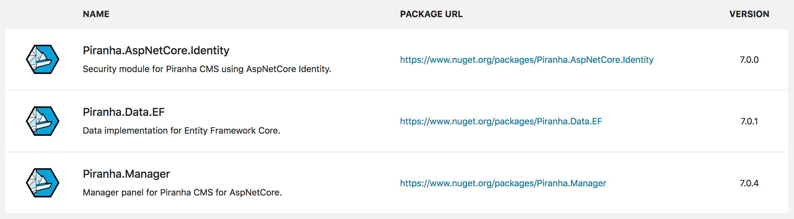

# Modules

If you want to distribute a set of custom components, a good way to do it is to package them into a **Module**. In Piranha a module is really nothing more than a NuGet-package (or project if you're creating a module for your self) that supplies some extensions methods and registers a class implementing the `Piranha.Extend.IModule` interface.

## Benefits

So what's the differences between creating a module over just building a package containing classes and other components.

### Module Initialization

When `App.Init()` is called from Configure in `Startup.cs` all registered modules are initialized. If your code is dependent on other parts of the application being initialized, packaging it as a module **ensures** that your code is executed at the correct time, and not before the main Piranha App is ready.

### Visual Module Information

Packaging your components as a module also renders it in the **Module section** in the manager, where your users can see the currently installed version and get a link to the current package version. You can also present information about the module and maybe link to your website for more documentation.

## Creating The Module Project

You have two options when creating your module project. If you are going to embed view componets (`Razor Pages`, `MVC Views` etc) or static resources (`CSS`, `Javascript`) you should create your project as a `Razor Class Library`. This is a project that supports embedding these types of resources in an easy way.

If your module will only contains classes you can create it as a standard `Class Library` as you won't need the features of the Razor Class Library.

Also, starting from `.NET Core 3.0` Razor Class Libraries will be dependent on having `netcoreapp3.0` as TargetFramework, but a Library can of course target `NetStandard`, so it all depends if, and where you want to be able to reuse your code.

## The IModule Interface

In order to be registered in the Piranha App, all modules need to have a class that implement the `Piranha.Extend.IModule` interface.

~~~ csharp
public interface IModule
{
    /// 

    /// Get the author for this module
    /// 

    string Author { get; }

    /// 

    /// Get the name of the module
    /// 

    string Name { get; }

    /// 

    /// Get the module version
    /// 

    string Version { get; }

    /// 

    /// Get the module description
    /// 

    string Description { get; }

    /// 

    /// Get the package url for the module
    /// 

    string PackageUrl { get; }

    /// 

    /// Gets the logo url for the module.
    /// 

    string IconUrl { get; }

    /// 

    /// Initializes the module.
    /// 

    void Init();
}
~~~

As you can see, all of the Properties that needs to implemented has to do with how the module is presented in the manager interface. The `Init()` method is where you take care of the actual initialization of your module.

As the `Init()` method is called from `App.Init()` in the Configure method you need to make sure that module is registered before this. The best place to do it is from an extension method in `ConfigureServices()`.

## Example

As an example, let's say we'd like to create a module containing a single block and a Vue component to render it in the manager. This is what the code could look like for initializing the module. The entire source code for this example is available in our main GitHub repo at:

[https://github.com/PiranhaCMS/piranha.core/tree/master/examples/SimpleModule](https://github.com/PiranhaCMS/piranha.core/tree/master/examples/SimpleModule)

##### Module.cs

~~~ csharp
using Piranha;
using Piranha.Extend;

namespace SimpleModule
{
    /// 

    /// The identity module.
    /// 

    public class Module : IModule
    {
        /// 

        /// Gets the Author
        /// 

        public string Author => "Test Author";

        /// 

        /// Gets the Name
        /// 

        public string Name => "SimpleModule";

        /// 

        /// Gets the Version
        /// 

        public string Version => Piranha.Utils
            .GetAssemblyVersion(GetType().Assembly);

        /// 

        /// Gets the description
        /// 

        public string Description => "Simple Module";

        /// 

        /// Gets the package url.
        /// 

        public string PackageUrl => "https://www.nuget.org/packages/SimpleModule";

        /// 

        /// Gets the icon url.
        /// 

        public string IconUrl => "http://piranhacms.org/assets/twitter-shield.png";

        /// 

        /// Initializes the module.
        /// 

        public void Init()
        {
            App.Blocks.Register<Blocks.HeaderBlock>();
        }
    }
}
~~~

##### SimpleModuleExtensions.cs

~~~ csharp
using Microsoft.AspNetCore.Builder;
using Microsoft.Extensions.DependencyInjection;
using Microsoft.Extensions.FileProviders;
using Piranha;
using SimpleModule;

public static class SimpleModuleExtensions
{
    public static IServiceCollection AddSimpleModule(this IServiceCollection services)
    {
        App.Modules.Register<Module>();

        return services;
    }

    public static IApplicationBuilder UseSimpleModule(this IApplicationBuilder builder)
    {
        // Manager resources
        App.Modules.Manager().Scripts
           .Add("~/manager/simplemodule/js/header-block.js");

        // Add the embedded resources
        return builder.UseStaticFiles(new StaticFileOptions
        {
            FileProvider = new EmbeddedFileProvider(typeof(SimpleModuleExtensions).Assembly,
                "SimpleModule.assets.dist"),
            RequestPath = "/manager/simplemodule"
        });
    }
}
~~~

## Using The Module

To use the module in our application all we have to do is to call the extensions methods in the correct place in our `Startup.cs`.

##### Startup.cs

~~~ csharp
public void ConfigureServices(IServiceCollection services)
{
    ...

    services.AddSimpleModule();

    ...
}

public void Configure(IApplicationBuilder app, IHostingEnvironment env, IApi api)
{
    ...

    app.UseSimpleModule();

    ...
}
~~~
