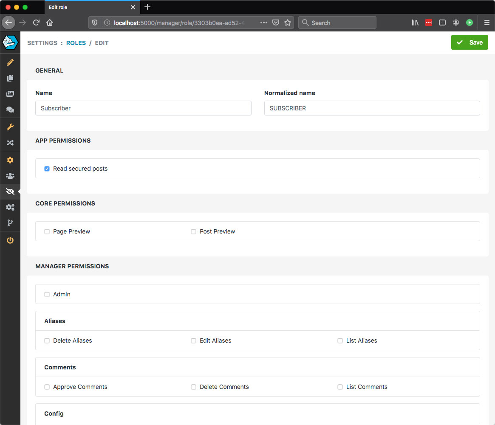
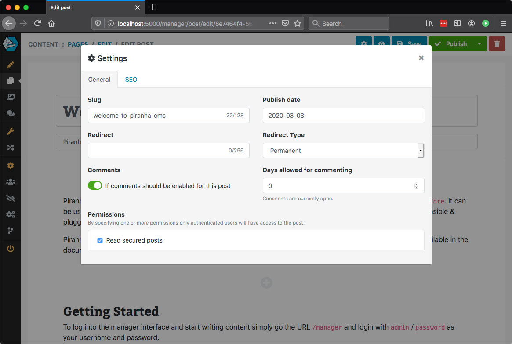

# Securing Pages

> In this tutorial we'll take a look at the recommended way to secure pages in your web application. When we talk about securing pages we mean pages or posts in your public web application that the user needs to be authenticated to view.

## Example Code

For this example we've started a new project from the **Blog Template** for `Razor Pages` which can be done by executing the following in your terminal:

~~~ bash
> dotnet new piranha.razor
~~~

## Adding Permissions

First off we need to add some permissions. or claims to our application that we are going to use in our front application. For this example we're going to add a new claim called `ReadSecuredPosts` and add that to a new **role** called `Subscriber`. Application claims are added in your `Startup.cs`.

~~~ csharp
public void ConfigureServices(IServiceCollection services)
{
    ...

    // Add custom policies
    services.AddAuthorization(o =>
    {
        // Read secured posts
        o.AddPolicy("ReadSecuredPosts", policy =>
        {
            policy.RequireClaim("ReadSecuredPosts", "ReadSecuredPosts");
        });
    });
}

public void Configure(IApplicationBuilder app, IWebHostEnvironment env, IApi api)
{
    ...

    // Custom permissions
    App.Permissions["App"].Add(new Piranha.Security.PermissionItem
    {
        Title = "Read secured posts",
        Name = "ReadSecuredPosts"
    });
}
~~~

## Creating The Role

Once this is done, let's restart the application and log into the manager and create our new Role `Subscriber`. This role should only have our new claim and look like this once created:

Secondly, let's open up the **Blog Archive** and the first available post "Welcome to Piranha CMS". After we've opened the post, let's open it's settings add select our new claim as a requirement to be able to view the post.

After this is done, you can see that when we try to access the post through our web browser we get a `401` because we're not authorized to view it.

## Adding Login Redirect

The simplest way of handling the fact that we will have two different login pages is to let the manager area use the `AuthorizeAttribute` and standard redirects of the `cookie options`. Loading a secured model with the `IModelLoader` will result in an `UnathorizedException` which will in turn result in a `401` being returned by `ASP.NET Core`.

Knowing this, let's add a middleware component first that listens to the result that comes back, if it is a `401` it means it's an unhandled **unauthorized** requests from one of our pages.

~~~ csharp
public void Configure(IApplicationBuilder app, IWebHostEnvironment env, IApi api)
{
    ...

    // Custom middleware that checks for status 401
    app.Use(async (ctx, next) =>
    {
        await next();

        if (ctx.Response.StatusCode == 401)
        {
            ctx.Response.Redirect("/login");
        }
    });

    // Standard Piranha middleware
    app.UsePiranha(options => {
        options.UseManager();
        options.UseTinyMCE();
        options.UseIdentity();
    });
}
~~~

## Creating The Login Page

Now the login of your application can be handled any way you'd like, but in this example we're just going to add a simple page with a form post.

#### Login.cshtml
~~~ csharp
@page
@model LoginPageModel
@{
    ViewBag.Title = "Login";
}

    <article>
        <header>
            <h1>Login</h1>
            
The content you requested is unfortunatly for authenticated eyes only. Please provide by logging in.

        </header>
        

            

                <form method="post">
                    

                        <label>Username</label>
                        <input type="text" name="Username" class="form-control">
                    

                    

                        <label>Password</label>
                        <input type="password" name="Password" class="form-control">
                    

                    <button class="btn btn-success">Login</button>
                </form>
            

        

    </article>

~~~

#### Login.cshtml.cs
~~~ csharp
using System.Threading.Tasks;
using Microsoft.AspNetCore.Mvc;
using Piranha;

namespace AuthTest.Pages
{
    public class LoginPageModel : Microsoft.AspNetCore.Mvc.RazorPages.PageModel
    {
        private readonly ISecurity _security;

        [BindProperty]
        public string Username { get; set; }
        [BindProperty]
        public string Password { get; set; }

        public LoginPageModel(ISecurity security) : base()
        {
            _security = security;
        }

        public async Task<IActionResult> OnPostAsync()
        {
            if (ModelState.IsValid && await _security.SignIn(HttpContext, Username, Password))
                return new RedirectResult("/");
            return Page();
        }
    }
}
~~~

## Wrapping it up

And that's about it. Everything in this example is of course as simple as possible to get the point across, but you can elaborate on this any way you like.
